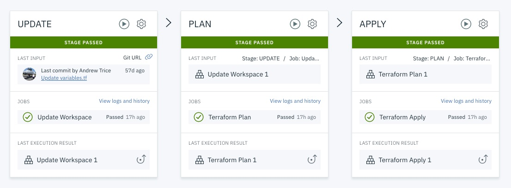

# IBM Schematics Terraform Template

This repo contains an Open Toolchain template for automating workflow with [IBM Cloud Schematics](http://cloud.ibm.com/schematics/), a service for managing infrastructure as code.  This template will configure a DevOps toolchain that will automatically invoke a delivery pipeline to update infrastructure automatically when commits are made to the Terraform template's git repo.  

## Getting Started
1.  First, [create an IBM Cloud Schematics workspace](https://cloud.ibm.com/schematics/workspaces/create)
2. Once the Workspace is created, go to the  "Settings" tab and click the "Enable continuous delivery" button.
3. Complete the toolchain setup form and click "Create" to create a toolchain

### To get started, click this button:

## Pipeline Details

The pipeline assumes a Schematics workspace already exists.  Follow the "Getting Started" section above to start by creating a Schematics workspace for you infrastructure as code/Terraform templates.

It implements the following best practices:
- Updates the Schematics workspace with any pipeline environment variables that match Terraform variables.  Any overrides to variables in the Schematics workspace should be done using environment variables on the delivery pipeline.
  - The "UPDATE" stage will inspect the terraform template and iterate over template variables. 
  - If there is an environment variable that exactly matches the template variable, the Schamatics workspace will be updated with the overriden values from the environment.
- Plan the changes to the infrastructure.  
- If the plan is successful, it will apply changes to the infrastructure.

